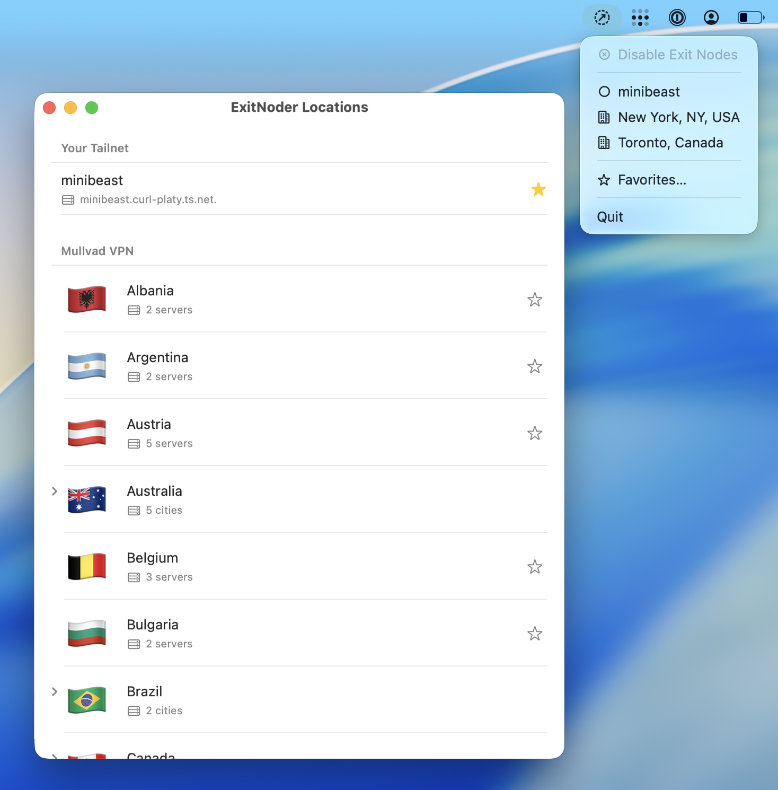

  

<h1 align="center">ExitNoder</h1>

  A lightweight macOS menu bar app for quickly switching Tailscale exit nodes.

  

---

> **Warning**
>
> **ExitNoder does NOT work with the Mac App Store version of Tailscale.** You must install the [standalone version of Tailscale](https://tailscale.com/download/mac) from tailscale.com. The App Store version runs in a sandbox that prevents ExitNoder from communicating with the Tailscale local API.

## Features

- **Menu Bar Access** - Switch exit nodes without opening the full Tailscale app
- **Favorites** - Save your most-used exit nodes for one-click access
- **Location Groups** - Group multiple nodes by location with automatic round-robin rotation

## Installation

### Requirements

- macOS 13.0 or later
- **Tailscale standalone version** (NOT the Mac App Store version)

### Download

Download the latest release from the [Releases](https://github.com/rossturk/ExitNoder/releases) page.

### Build from Source

1. Clone the repository
2. Open `ExitNoder.xcodeproj` in Xcode
3. Build and run

## Usage

1. Make sure Tailscale is running (standalone version)
2. Click the ExitNoder icon in your menu bar
3. Use "Favorites..." to add your preferred exit nodes
4. Click any favorite to activate it, or click Disable Exit Nodes to disconnect

## Why Standalone Tailscale?

The Mac App Store version of Tailscale runs in a sandboxed environment and uses a different IPC mechanism. ExitNoder communicates with Tailscale via its local HTTP API (available at `/Library/Tailscale`), which is only accessible with the standalone version.

If you currently have the App Store version installed:
1. Uninstall Tailscale from the App Store
2. Download the standalone version from [tailscale.com/download/mac](https://tailscale.com/download/mac)
3. Log in to your Tailnet

## License

MIT
